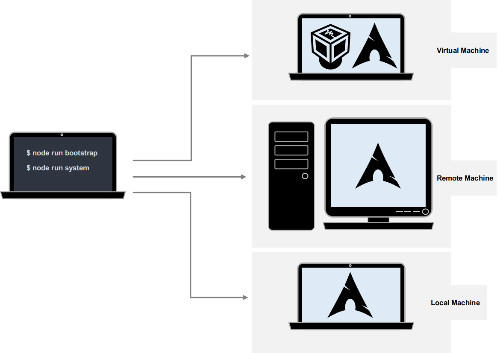

# Architecture

## Overview



**`node-nikita-arch`** is a tool that provides automated installation of Arch Linux on a local or remote machine. It comes with two main commands `bootstrap` and `system` located in the `lib/bootstrap` and `lib/system` directories respectively. The `bootstrap` command initiates and runs a set of actions that will format, encrypt and partition disk and install a minimal and functioning distribution while the `system` deploys all additional configurations, tools and services. Both steps can be configured by direct user input or using configuration JavaScript serialized objects. Noteworthy to say, **`node-nikita-arch`** leverages our automation and deployment solution written in Nodejs, [Nikita](https://nikita.js.org/). As such an understanding of how it works might help.

## Code map

Herein we will describe the important modules and piece of code that articulate our repository. We will focus notably on how each interacts with others to provide a comprehensive deployment and installation of Arch Linux. You can see below an architecture of the project:

```
.
├── CHANGELOG.md
├── conf
│   ├── bootstrap.coffee
│   ├── system.coffee
│   └── user.yaml
├── doc/
├── lib
│   ├── actions
│   │   ├── apm.coffee.md
│   │   ├── gsettings.coffee.md
│   │   ├── mod.coffee.md
│   │   └── npm.coffee.md
│   ├── bootstrap
│   │   ├── 1.welcome.coffee
│   │   ├── 2.disk.coffee
│   │   └── 3.system.coffee
│   ├── config.coffee
│   ├── index.coffee
│   ├── run.coffee
│   └── system
│       ├── 1.system.coffee
│       ├── 2.dev.coffee
│       └── 3.office.coffee
├── package.json
├── package-lock.json
└── README.md
```

### Configure `bootstrap` and `system` processes

Having a look to the code sitting in the main entry point of our package (`lib/index.coffee`) revealed a step-wise process for **`node-nikita-arch`** installation encapsulated in two asynchronous functions:

```coffeescript
config = require './config'
run = require './run'

(->
  try
    await config()
    await run()
  catch e
    process.stdout.write e.stack
)()
```

The first `config()` function will set and write the configuration file necessary for installation. Indeed when running the `bootstrap` or `system` commands the user will be prompted to enter some inputs to define: ***(i)*** SSH target IP address, ***(ii)*** SSH target password and ***(iii)*** SSH target port, ***(iv)*** disk encryption password, ***(v)*** Arch Linux user name and ***(vi)*** Arch Linux user password. This process is defined in the `lib/config.coffee` module and leverages the `prompts` Nodejs package. User input will be used to set values for the respective properties present in the `config` JavaScript object that is defined in the same file. Briefly the `config` object has two outer main properties respectively named `bootstrap` and `system`.   

```coffeescript
# Code has been omitted for brevety
config = {
    bootstrap: # {...config content...}
    system:    # {...config content...} 
}
```

Next the `config` object will be serialized and written into a `conf/user.yaml ` file. Note however that some values in the `config` object are predefined by default and can be altered at the discretion of the user.

The second function is `run()`. It loads the `lib/run.coffee` module functionality. This module performs several tasks. it loads the `conf/user.yaml ` and merges its content with the configuration files defined in the `conf` directory using the Nodejs `merge` package. The `conf` directory contains two modules: one named `bootstrap.coffee` and another one named `system.coffee`. The merging process has been coded such that when the `bootstrap` command is run it will specifically merge the value of the `config.bootstrap` property found in the `conf/user.yaml ` with the content of the `bootstrap.coffee` file. Similarly when using the `system` command, only expected configuration for this process will be merged and used. This was implemented in `lib/run.coffee` as followed:

```coffeescript
# Code has been omitted for brevety
target = path.resolve __dirname, '../conf/user.yaml'
config = yaml.safeLoad fs.readFileSync target
action = process.argv[2]
config = merge require(path.join "#{__dirname}/../conf", action), config[action]
```

The `process.argv` returns an array containing the command-line arguments. Consequently when using:

```bash
npm run bootstrap
```

`process.argv[2]` will return the string `bootstrap` that will be assigned to the `action` variable. Now looking at the merging code it is pretty trivial to understand what is happening. `conf/bootstrap.coffee` will be loaded and recursively merged with the content of the `config.bootstrap` JavaScript object found in our `conf/user.yaml` file. As such all configuration settings are ready to be used to bootstrap our Arch Linux installation.

### Install Arch Linux

The installation process relies on the execution of sequential Nikita actions. In `lib/run.coffee` , after having loaded and merged the expected configuration, a Nikita session is instantiated. We then iterate through the `config` object (described above) keys and values and execute Nikita actions by using the `nikita.call` function. The sequence of Nikita actions is defined in the files located in the `conf` directory. Let see an example for the `bootstrap.coffee` file:

```coffeescript
# Code has been omitted for brevety
module.exports =
  '@nikitajs/core/lib/log/cli':
   # {...}
  '@nikitajs/core/lib/log/md':
   # {...}
  '@nikitajs/core/lib/ssh/open':
   # {...}
  './lib/bootstrap/1.welcome': {}
  './lib/bootstrap/2.disk':
   # {...}
  './lib/bootstrap/3.system':
   # {...}
  '@nikitajs/core/lib/ssh/close': {}

```

In this case the keys and their associated values are going to be passed to the `nikita.call`. Some keys will point to register Nikita actions (i.e., `'@nikitajs/core/lib/log/cli'`) whereas others point to user-defined Nikita actions (i.e., `'./lib/bootstrap/2.disk'`). The associated values will be also passed to `nikita.call` and then used by each Nikita actions as an `{options}` object that will supply the expected context for each Nikita actions. The user defined Nikita actions for the `bootstrap` and `system` commands can be found in `lib/bootstrap` and `lib/system` respectively.

#### Local or remote

Our tool lets the user choosing between a local or recommended remote installation using SSH. To establish a SSH connection we used the registered `nikita.ssh.open` [Nikita action](https://github.com/adaltas/node-nikita/blob/master/packages/core/src/actions/ssh/open.coffee.md). The connection and its configuration is going to be set based on the user input as described previously. One very important property is `disabled` which is a Nikita metadata that contextualized the execution of this action. 

If the user input for `'Connection'` is `'remote'` the value of the `disabled` key will be set to false and the SHH connection will be initialized and established. In contrast if the user input is `'local'` the connection will not be established as `disabled` will be set to true. The implementation of this can be found in `lib/config.coffee`.   

Every established connections will be closed at the end of the process by using the `nikita.ssh.close` [Nikita action](https://github.com/adaltas/node-nikita/blob/master/packages/core/src/actions/ssh/close.coffee.md).

#### Process logging

Error messages and other logs details are outputted and details are saved in a specific folder called `log`. As soon as you will run one of the command, Nikita will create a `log` folder inside which logs will be written in markdown format. Short messages outputs and log writes rely on the use of `nikita.log.cli` and `nikita.log.md` functions. Both functions are implemented in files located in the `./conf/` folder.


